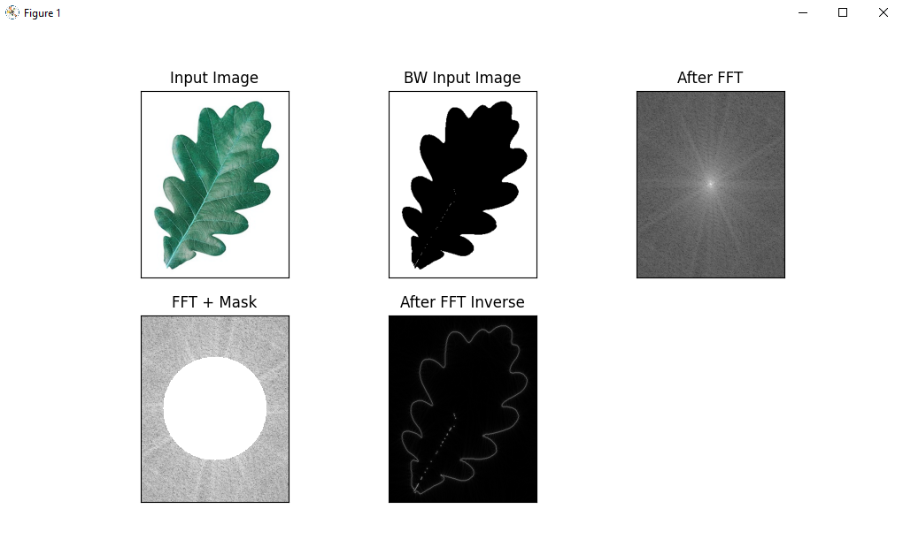

# README #

### TO DO ###
- Update README
- Clean-up code
- Add test images
- Add argparser to specify for the image it should run

## How do I get set up? ##

```bash
$ python3 -m venv venv
```
### Windows/Linux
```
$ .\venv\Scripts\activate.bat
$ source venv/bin/activate
```

### Install dependencies
```
$ pip3 install -r dependencies.txt
$ python3 main.py
```

# Example boundary description

